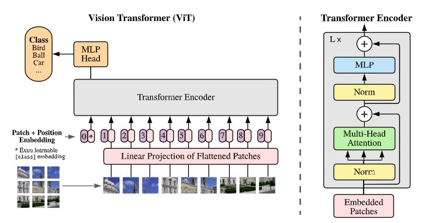

# An Image Is Worth 16x16 Words: Transformers For Image Recognition At Scale

## Contents

* [Paper](Paper.pdf)

## Summary 

In Computer Vision, attention is applied in conjunction with convolutional networks or used to replace components of convolutional networks keeping their overal structure in place.

### Approach

The image is split into patches and the sequence of linear embeddings of these patches are provided as input to a Transformer. Image patches are treated the same was as tokens in NLP. 

When trained pre-trained at a large scale and transferred to smaller tasks, ViT approaches SoTA Image Recognition benchmarks.

## Architecture

The model design follows the original Transformer.

### Vision Transformer

The standard Transformer receives as input a 1D sequence of token embeddings. The image  is reshaped into  sequence of flattened 2D patches  where (H,W)is the resolution of the original image, C is the number of channels, (P,P) is the resolution of each image patch and  is the resulting number of patches, the input sequence length for the transformer.

The Transformer uses a constant latent vector of size D through all of its layers. The flattened patches are mapped to D dimensions with a trainable linear projection.

A learnable embedding to the sequence of embedded patches  is prepended whose state at the output of the Transformer encoder  serves as the image representation y. During both pre-training and fine-tuning, a classification head is attached to . The classification head is implemented by a MLP with one hidden layer at pre-training and by a single linear layer at fine-tuning.

Standard learnable 1D Position embeddings are added to the patch embeddings to retain positional information. The resulting sequence of embedding vectors serves as input to the encoder.

The MLP contains two layers with a GELU non-linearity.

##### Inductive Bias

The Vision Transformer has much less image-specific inductive bias than CNNs. In CNNs, two-dimensional neighbourhood structure and translation equivariance are built in each layer of the whole model, whereas, in ViT, only the MLP layers are local and translationally equivariant while the self-attention layers are global.

#### Fine-Tuning 

The ViT is pre-trained on large datasets and then fine-tuned to downstream tasks. The pre-trained prediction head is remobed and a zero-initialized feed-forward layer is attached. 2D interpolation are preformed on the pre-trained position embeddings. When feeding images of higher resolution, the patch size is same which results in a larger effective sequence length.

## Implementation

* [Original Implementation](https://github.com/google-research/vision_transformer)

* [HuggingFace Implementation](https://github.com/huggingface/transformers)

* [Pytorch Image Models](https://github.com/rwightman/pytorch-image-models/blob/master/timm/models/vision_transformer.py)
