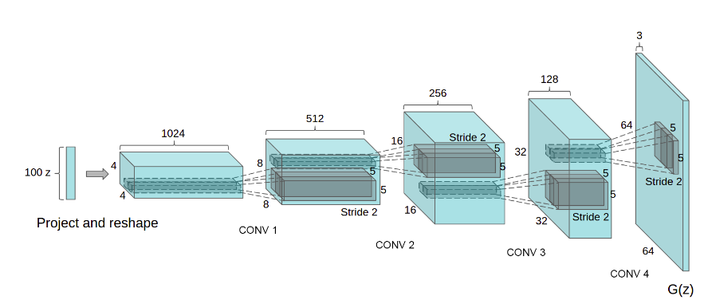

# Unsupervised Representational Learning With Deep Convolutional Generative Adversarial Networks

## Contents

* [Paper](Paper.pdf)

## Summary 

Leveraging the practically unlimited amount of unlabeled images to learn a good intermediate representation, which can be used on a variety of supervised learning tasks such as image classification.

### Architecture

Attempts to scale up GANs using CNNs to model images have been unsuccessful. The core approach is to adopt and modify the three demonstrated changes to CNN architectures which result in stable training.

* The first is the all Convolutional Net which replaces deterministic spatial pooling layers (maxpooling) with strided convolutions, allowing the network to learn its own spatial downsampling.

* The second is the trend towards eliminating fully connected layers on top of the Convolutional features, which increased stability but hurt convergence speed. Connecting the highest convolutional features to the input and output respectively of the generator and the discriminator worked the best. 

* The third is batch normalization, which stabilizes learning by normalizing the input to each unit having zero mean and unit variance.

* The ReLU activation is used in the generator with the exception of the output layer which uses the Tanh function. LeakyReLU us used in the discriminator for higher resolution modeling.

## Implementation

* [Implementation](https://github.com/eriklindernoren/PyTorch-GAN/blob/master/implementations/dcgan/dcgan.py)