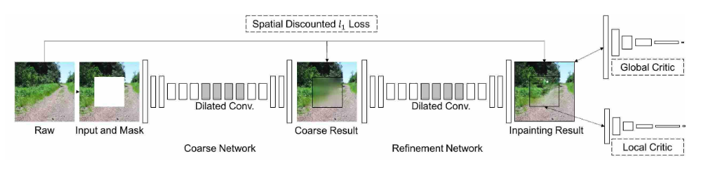

# Generative Image Inpainting with Contextual Attention

## Contents

* [Paper](Paper.pdf)

## Summary 

Recent Deep Learning based methods can generate visually plausible image structures and textures but often create distorted structures or blurry textures inconsistent with the surrounding areas.

Image Inpainting or completion is the process of filling missing pixels of an image. The core challenge of image impainting lies in synthesizing visually realistic and semantically plausible pixels for the missing regions.

Image inpainting is formulated as a conditional image generation problem where high-level recognition and low-level pixel synthesis are formulated into a convolutional encoded-decoded network jointly trained with adversarial networks. 

### Approach

A unified feed-forward generative network with a novel contextual attention layer for image impainting. The network consists of two stages.

* The first stage is a simple dilated convolutional network trained with reconstruction loss to rough out the missing contents.

* The second stage is to integrate contextual attention to use the features of known patches as convolutional filters to process the generated patches. The contextual attention module also has spatial propogation layer to encourage spatial coherency. In orger to allow the network to hallucinate novel contents, another convolutional pathway is constructed in parallel with the attention pathway. The two pathways are aggregated and fed into a single decoded to obtain the final output.

The whole network is trained end to end with reconstruction losses and two GAN losses.

## Architecture

### Coarse-To-Fine Network

The generator network takes an image with white pixels filled in the holes and a binary mask indicating the hole regions as input pairs and outputs the final completec image. The inouut is paired with corresponding binary mask to handle holes with variable sizes, shapes and locations.

The input to the network is a 256x256 image with rectangle missing region sampled randomly during training.

In image impainting tasks, the size of receptive fields should be sufficiently large. To further enlarge the receptive fields and stabilize training, two stage coarse-to-fine network architecture is used, where,

* The first network makes an initial coarse prediction,
* The second network takes the coarse prediction as input and predicts the refined results. 

The coarse network is trained with reconstruction as well as GAN losses.

### Global and Local Wasserstein GANs

A modified version of WGAN-GP where the GAN loss is attached to both global and local outputs of the second-stage refinement network.

WGAN uses Earth-Mover distance W(P_r, P_g) for comparing the generated and the real data distributions. Its objectibe function is constructed by applying 

## Implementation

* [Implementation]()