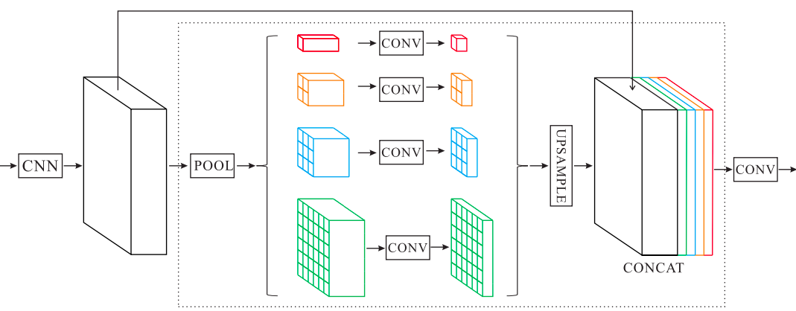

# Pyramid Scene Parsing Network

## Contents

* [Paper](Paper.pdf)
* [Setup Script](setup.sh)
* [Scripts](scripts/)

## Summary 

The goal of **Scene Parsing** is to assign each pixel in the image a category label. Scene Parsing provides complete understanding of the scene - predicts label, location and shape of each element.

### Disadvantages of using FCN Baseline

* Mismatched Relationship - Lack of the ability to collect contextual information increases the chance of misclassification.

* Confusion Categories - Existance of classes which are similar in appearance. 

* Inconspicuous Classes - The size of the object and its importance may not be directly proportional. For example, a very small object is often of great importance.

### Pyramid Pooling Module

In deep neural networks, the size of receptive field can roughly indicates how much we use context information. Theoretically, the receptive field of ResNet is already larger than the input image, that the empirica; receptive field of CNN is much smaller than the theoretical one especially on high-level layers. 

Global average pooling is a goodbaseline model as the global contextual prior, which is in image classification tasks.  In a complex case, this strategy is not enough to cover the necessary information. Therefore, Global Context information along with sub-region context is more helpful to distinguish among various categories. 

Feature maps in different levels generated by pyramid pooling are flattened and concatenated and fed into a fully connected layer for classification. This global prior removes the fixed-size contraint of CNN for image classification. 

The **pyramid pooling module** involves hierarchical global prior. containing information with different scales and varying among different sub-regions. The module fuses features under four different pyramid scales.

### Architecture

Given the input image, a pretrained ResNet model with dilated network stratefy is used to extract the feature map. On this map, the pyramid pooling module is used to gather context information. Using 4-level pyramid, the poolign kernels cover different sub-regions of the image and then fused together as the global prior. The global prior is catenated with the original feature map and fed into a convolution layer to generate the final prediction map.

PSPNet provides an effective global prior for pixel-level scene parsing.

## Implementation

* [Original Implementation](https://github.com/hszhao/semseg/tree/7192f922b99468969cfd4535e3e35a838994b115)
	- [Code](https://github.com/hszhao/semseg/blob/7192f922b99468969cfd4535e3e35a838994b115/model/pspnet.py#L8)

* [CSAILVision](https://github.com/CSAILVision/semantic-segmentation-pytorch)
	- [Notebook](https://colab.research.google.com/github/CSAILVision/semantic-segmentation-pytorch/blob/master/notebooks/DemoSegmenter.ipynb)

* Using the Stanford Background Dataset - [Link to DataSet](https://www.kaggle.com/balraj98/stanford-background-dataset#)