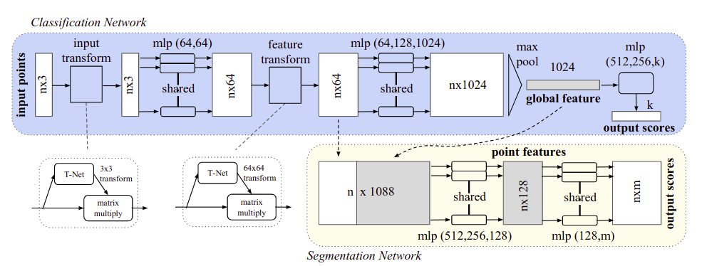

# Deep Learning on Point Sets for 3D Classification and Segmentation

## Contents

* [PointNet](Paper.pdf)
* [PointNet++](Paper++.pdf)

## Summary 

In this paper, a novel type of neural network is designed that directly consumes point clouds, providing a unified architecture for applications ranging from Object classification, Part segmentation to scene semantic parsing.

Typical convolutional architectures require highly regular input data formats like image grids or 3D voxels in order to perform weight sharing and other kernel optimizations. \\
Since point clouds are not in a regular format, they are typically transformed to regular 3D voxel grids or collection of images before feeding to the deep net architecture. This data representation transformation renders the resulting data unnecessarily voluminous.

PointNet is a unified architecture that directly takes point clouds as inputs and outputs either class labels for the entire input or per point segment labels for each point of the input. 

## Problem Statement

The basic architecture of the network is simple as in the initial stages, each point is processed identically and independently. The points are represented by just three coordinates (x, y, z). Additional dimensions may be added by computing normals and other local or global features.

A deep learning framework that directly consumes unordered point sets as inputs. A point cloud is represented as a set of 3D points  where each point P is a vector of its (x, y, z) coordinate plus extra feature channels such as color, normal, etc. 

* For the **Object Classification** task, the input cloud is directly sampled from a shape or pre-segmented from a scene point cloud.

* For **Semantic Segmentation**, the input can be a single object for part region segmentation or a sub-volume from a 3D scene for object region segmentation.

## Architecture

The network has three key modules:
* The max pooling layer as a symmetric function to aggregate information from all the points
* A local and global information combintion structure
* A two joint alignment network that aligns both input points and features.

### Symmetry Function for Unordered Input

In order to make a model invarient to input permutation, three strategies exist
- Sort input into a canonical order
- Treat the input as a sequence to train an RNN
- Use a simple symmetric function to aggregate the information from each point.

The symmetric function takes n vectors as input and outputs a new vector that is invariant to the input order. The idea is to approximate a general function defined on a point set by applying a symmetric function on transformed elements in the set.
 where ,  and .

## Implementation

* [PointNet Implementation](https://github.com/fxia22/pointnet.pytorch)
* [PointNet++ Implementation](https://github.com/facebookresearch/votenet)
