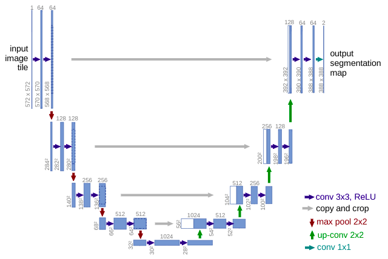

# U-Net: Convolutional Networks for BiomedicalImage Segmentation

## Contents

* [Paper](Paper.pdf)
* [Scripts](scripts/)

## Summary 

Convolutional Networks have limited success due to the size and availability of training sets. The typical use of Convolutional Networks is to predict the image as a single class label. However, in many visual tasks, the desired output should include localization, i.e., each pixel is to be assigned a class label.

### Architecture

A more elegant architecture (fully convolutional network) is extended such that it works with very few training images and yeilds precise segmentations. 

The main idea is to supplement a usual contracting network by successive layers, whose pooling operators are replaced by upsampling operators. The architecture consists of a Contracting Path and an Expansive Path.

#### Contracting Path

Consists of repeated application of two 3x3 convolutions followed by a ReLU unit and 2x2 max pooling operation with stride 2 for downsampling.

At each downsampling step, the number of feature chanels are doubled.

#### Expansive Path

Consists of upsampling of the feature map followed by 2x2 convolutions that halves the number of feature channels, a concatenation with the correspondingly cropped feature map from the contracting path, and two 3x3 convolutions followed by a ReLU.

#### Final Layer

A 1x1 convolution is used to map each 64 component feature vector to the desired number of classes. 

## Implementation

* [Implementation](https://github.com/milesial/Pytorch-UNet)