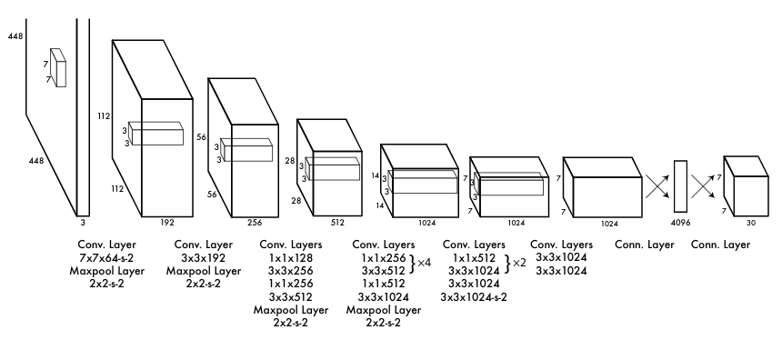

# You Only Look Once: Unified, Real-Time Object Detection

## Contents

* [Paper](Paper.pdf)

## Summary 

A new approach to object detection, a regression problem to spatially separated bounding boxes and associated class probabilities.

YOLO learns very general representation of objects but is less likely to predict false positives.

### Architecture

Unlike sliding window and region proposal-based techniques, YOLO sees the entire image during training and test time so it implicitly encodes contextual information about classes and their appearance.

#### Unified Detection

Seperate components of object detection are unified into a single neural network. Features from the entire image are used to predict each bounding box.

The input image is divided into an SxS grid. If the center of an object falls into a grid cell, then that grid cell is repsonsible for detecting that object.

Each grid cell predicts B bounding boxes and confidence scores for those boxes, reflecting how confident the model is that the box contains an object.

Each bounding box contains 5 predictions: x, y, w, h and confidence. The (x,y) coordinates represent the centre of the box relative to the bounds of the grid cell. The (w,h), width and height, are predicted relative to the whole image.

Each grid cell also predicts C conditional class probabilities, conditioned on the gird cell containing an object.

At the test time, the conditional class probabilities and the individual box confidence are multiplied to give class-specific confidence scores for each box. 

#### Network Design

Initial convolutional layers of the network extract features from the image while the fully connected layers predict the output probabilities and coordinates.

The network has 24 convolutional layers (1x1 reduction layers followed by 3x3 convolutional layers) followed by 2 fully connected layers. 

The first 20 convolutional layers are pretrained on the ImageNet dataset and then is converted to perform detection by adding the remaining 4 convolutional layers and the 2 fully connected layers with randomly initialized weights.

## Implementation

* [Website](https://pjreddie.com/darknet/yolo/)
* [Implementation](https://github.com/WongKinYiu/ScaledYOLOv4)